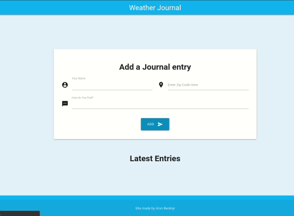

# Weather Journal

## Preview

[Live Demo](https://u-weather-journal.herokuapp.com/)

## What is it?

 An excercise site made from scratch.
 You can type in your name, zip code, and how do you feel, and it will make it into a Journal entry. When you type in the zip code, a dropdown will appear, showing the possible matches with the city and country name. In your entry you will see the current weather and temperature in celsius too. The first version used a simple .json file as a "database", but to be able to deploy to Heroku, it isn't allowed. So it uses postgreSQL instead.

It is my first project, tinkering around with server side Javascript, Postgres and even a CSS framework.

## Technologies used
* HTML
* SASS, MaterializeCSS
* JavaScript
* Node.js and Express as a server 
* PostgreSQL as a database
* AccuWeather API

## But... Why?
I started learning web development years ago, followed a bunch of tutorials, but never felt confident enough with my skills. Now I enrolled for the free month of Udacity's [Front End nanodegree](https://www.udacity.com/course/front-end-web-developer-nanodegree--nd0011), to check it out. 

To practice, I made this site from scratch. The new things were for me the Node.js part and the database. Besides It is my first time trying out a CSS framework. It is kinda nice, a bit faster to create a site, but a lot less control, and a bunch of tinkering with it... It was fun, I have learned a lot. 

## Random Quote

> I get the biggest enjoyment from the random and unexpected places. Linux on cellphones or refrigerators, just because it's so not what I envisioned it. Or on supercomputers.

-Linus Torvalds

